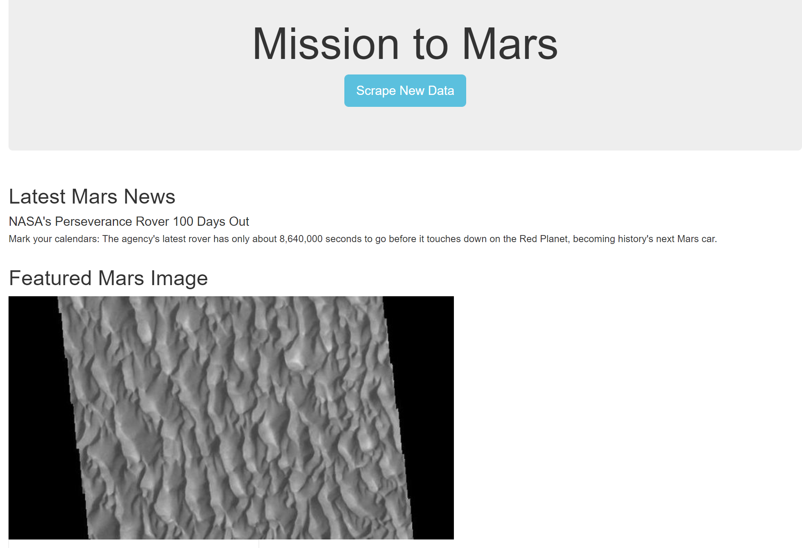
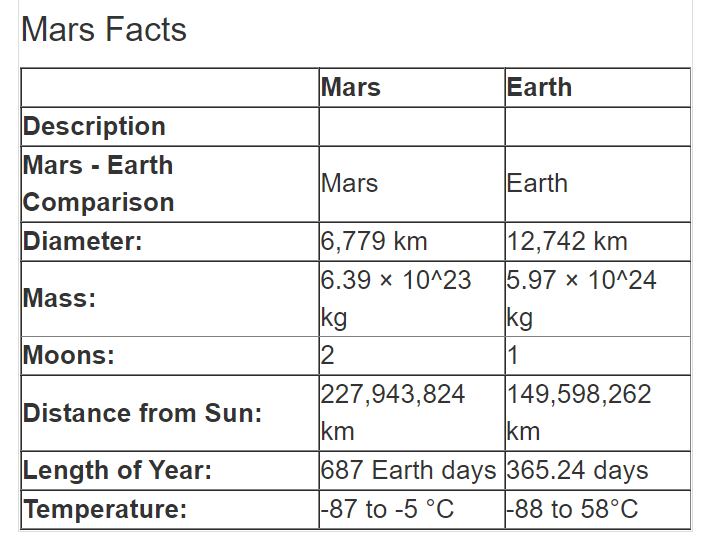
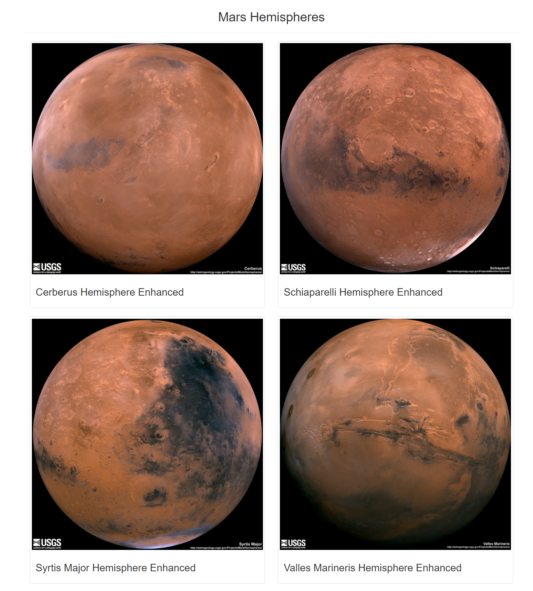

# Mission-to-Mars
## Purpose
Robin likes the web app we have created. However, she wants to add full-resolution images of Mar's hemispheres to the web app. We will use BeautifulSoup and Splinter to scrape the images and the titles of the images. She would also like for us to polish up the web app by altering the design.
## Files of Code
### Mission to Mars Challenge Code
\

### Scraping File

### App File

### HTML File 

## Images
Image 1:\
\
Image 2:\
\
Image 3:\

